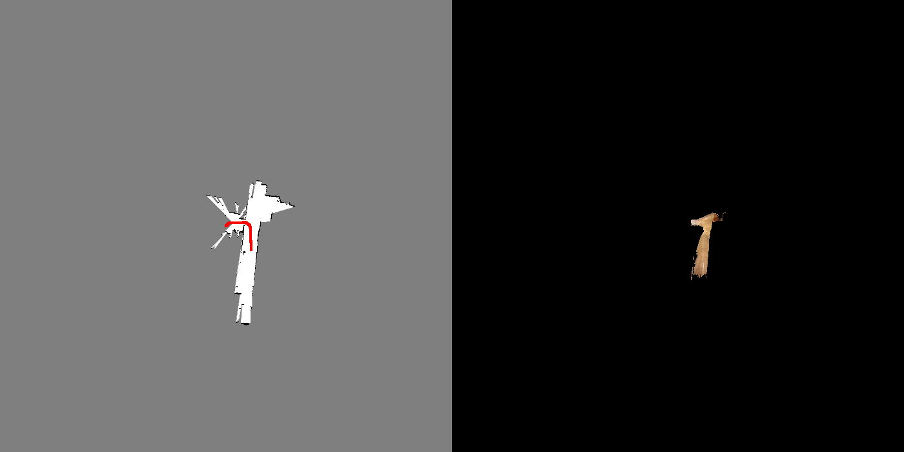

# ICP_PGO_SLAM
This SLAM system utilizes ICP as its front end, integrates IMU and wheel encoders, utilizes loop closure detection and pose graph optimization in the backend, and employs RGBD point clouds for texture coloring.

