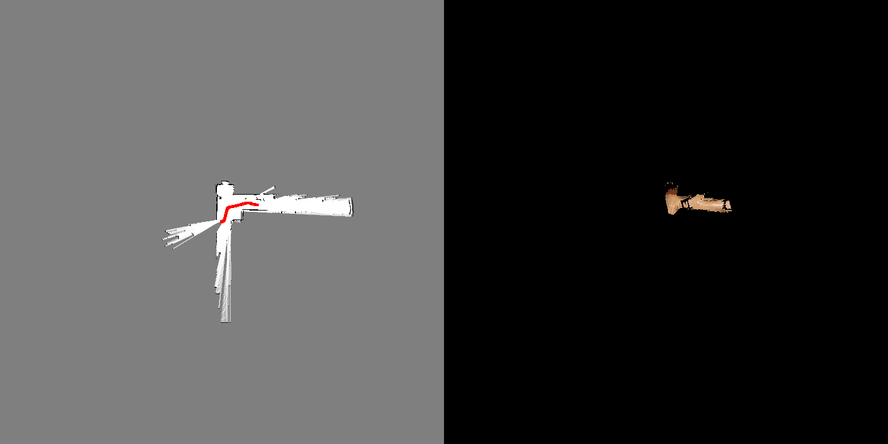

# ICP_PGO_SLAM
This SLAM system utilizes ICP as its front end, integrates IMU and wheel encoders, utilizes loop closure detection and pose graph optimization in the backend, and employs RGBD point clouds for texture coloring.

# Installation
``` bash
conda create -n icp_pgo python=3.8
conda activate icp_pgo
pip install -r requirements.txt
```

# Usage
1. Run `python mapping.py` to do mapping. You can modify `dataset = 20` to change the dataset.
2. If you wanna record the mapping process, uncomment the last four lines in `python mapping.py`. After the mapping is down, run `python generate_gif.py` to generate a gif. The results is already in the folder "assets".
3. You can alse see the ablation experiments of the mapping details in the unit tests, which is in the file "mapping_unit_test_20.ipynb" and "mapping_unit_test_20.ipynb"

# Example
- Dataset 20

- Dataset 21
